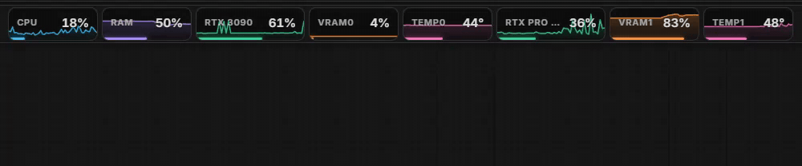
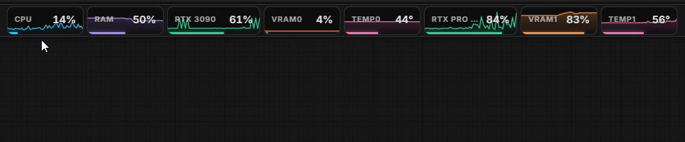
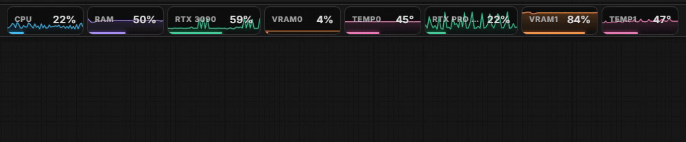
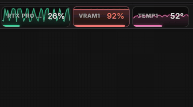
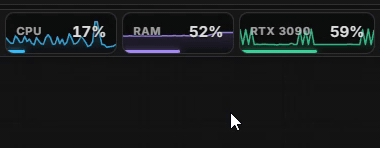

# ComfyUI Advanced Monitor

Sleek, modern resource monitors for the ComfyUI toolbar — a lightweight, actively-maintainable replacement for the resource monitor portion of the deprecated ComfyUI-Crystools.



Each monitor is a compact "pill" in the top menu bar with a **live sparkline**, a color-coded usage bar, and a hover tooltip with exact values:

- **CPU** — utilization %
- **RAM** — usage % (tooltip shows used / total GB)
- **GPU** — utilization % (per GPU, via NVML)
- **VRAM** — usage % (tooltip shows used / total GB)
- **TEMP** — GPU core temperature °C
- **DISK** — usage of the drive ComfyUI is installed on (hidden by default)

Hover any pill for exact numbers — used / total GB and the full GPU model name:



Monitors turn red when they hit dangerous levels (90% usage / 85 °C):



**Click the VRAM or RAM pill** for one-click memory actions:

- **VRAM** — *Unload models* (moves all loaded models out of VRAM, same as ComfyUI's native unload) or *Purge VRAM cache* (empties the CUDA allocator cache)



- **RAM** — *Purge RAM* (clears ComfyUI's execution cache, unloads models, and garbage-collects)



Unload/purge requests are handled by ComfyUI's prompt worker, so they're always execution-safe — if a job is running, they apply as soon as it finishes.

Multiple NVIDIA GPUs each get their own set of pills. No workflow nodes are added — this package is purely the toolbar UI plus a tiny stats stream.

## Install

Copy or clone this folder into your ComfyUI `custom_nodes` directory:

```
ComfyUI/custom_nodes/comfyui-advanced-monitor
```

Then install the dependencies **into ComfyUI's Python environment** and restart ComfyUI:

```bash
# Standard install
pip install -r requirements.txt

# ComfyUI portable (run from the portable root)
python_embeded\python.exe -m pip install -r ComfyUI\custom_nodes\comfyui-advanced-monitor\requirements.txt
```

`psutil` ships with ComfyUI already; `nvidia-ml-py` is only needed for the GPU / VRAM / Temp monitors. Without an NVIDIA GPU (or without the package) the GPU pills simply don't appear — CPU/RAM/Disk still work.

## Settings

Open ComfyUI **Settings → AdvancedMonitor**:

| Setting | Default | Description |
| --- | --- | --- |
| Refresh rate (seconds) | 1.0 | How often stats are sampled and pushed (0.25–5 s) |
| Show CPU monitor | on | |
| Show RAM monitor | on | |
| Show GPU utilization monitor | on | |
| Show VRAM monitor | on | |
| Show GPU temperature monitor | on | |
| Show disk usage monitor | off | Drive that ComfyUI lives on |

## How it works

- `monitor.py` runs a daemon thread that samples stats with `psutil` (CPU/RAM/disk) and NVML (`nvidia-ml-py`) for GPU stats, then broadcasts them to the browser over ComfyUI's existing websocket (`cam.monitor` event). Sampling pauses automatically when no browser tab is connected.
- `web/monitor.js` renders the pills, injects them next to the settings buttons in the top menu bar (with fallbacks for other frontend layouts), and exposes the settings. The refresh rate is synced to the backend via `PATCH /advanced_monitor/config`.
